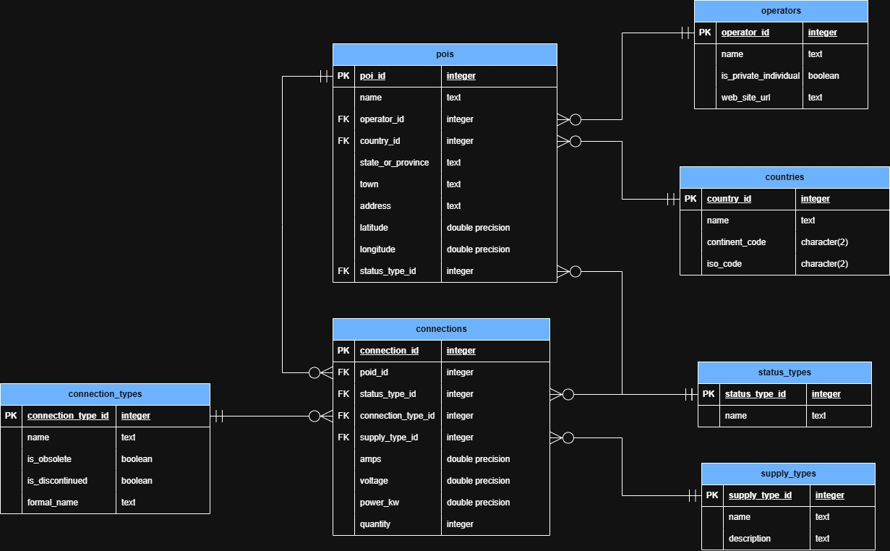

# ETL_OpenChargeMap
Desarrollo de ETL para extracción de datos desde API Open Charge Map (Puntos de carga para vehículos eléctricos) y carga de datos en base de datos de PostgreSQL.


## Objetivo del proyecto
- Construir un ETL básico que permita extraer datos desde la API Open Charge Map, transformarlos y almacenarlos en PostgreSQL, generando una base estructurada que permita futuros análisis sobre infraestructura de electromovilidad en Chile. 


## Stack tecnológico
- API Open Charge Map (https://openchargemap.org)
- Python (Anaconda)
- Jupyter Notebooks
- PostgreSQL
- GitHub


## Conceptos importantes
- **EVSE:** (Electric Vehicle Supply Equipment), Conjunto de hardware y software que transfiere energía de forma segura desde la red eléctrica a la batería de un vehículo eléctrico o híbrido enchufable. Se les conoce por diversos nombres, tales como: cargadores, estaciones de carga o puntos de carga.
- **POI:** (Point of interest), punto de interés. Estaciones de servicio de carga EVSE.


## Desarollo

### Creación de entorno 
Crear el entorno con anaconda:
``` bash
conda create -n etl_openchargemap python=3.11
conda activate openchargemap
```

> [!NOTE]
> Descargar las librerias necesarias considerando el archivo `requeriments.py`

### Estructura del proyecto
- `.env`: Archivo que contiene las variables de entorno del proyecto. En el repositorio se encuentra con nombre **.env.example**. 
- `sql`: Carpeta contenedora de los scripts sql necesarios para contruir la base de datos en PostgreSQL.
- `src`: Carpeta contenedora de los archivos del proyecto.
    - `api_exploracion.ipynb`: Jupiter Notebook, obtención de los datos, transformaciones y limpiezas exploratorias.
    - `config.py`: Archivo python con las configuraciones necesarias para el proyecto. (Obtención de variables de entorno y conexión de base de datos)
    - `loaders`: Carpeta contenedora de los archivos python de carga de las distintas entidades / tablas. Considera un archivo por cada una para mantener modularidad.

> [!NOTE]
> Para la ejecución del proyecto se debe considerar renombrar o generar el archivo `.env` en base a `.env.example` considerando los valores de variables que poseas.

### Conexión y exploración de datos de API Open Charge Map
Generación de un Jupyter notebook, archivo `api_exploracion.ipynb` para exploración de los datos entregados por la API. Se revisa la estructura Y se aplican limpiezas y transformaciones.
- Extracción de los puntos de interés o estaciones de carga (POI) y sus conexiones disponibles en Chile.
- Extracción de datos de referencia:
    - Estaciones de carga y puntos de conexion.
    - Operadores.
    - Tipos de conexiones, suministro y estados.
    - Países.

### Modelo de datos es PostgreSQL
Una vez explorados los datos y determinado el set necesario para el análisis, se define y construye el modelo de datos: 



Se debe tener en consideración la siguiente equivalendia de datos de la API con el modelo:

> **Tipos de conecciones** <br>
> Tipo de conexión para usuario final con soporte EVSE. Hace referencia al tipo de enchufe.<br>
> API: ConnectionTypes <br>
> BD: connection_types <br>

> **Operadores** <br>
> Empresa u organización que controla la red de puntos de carga. <br>
> API: Operators <br>
> BD: operators <br>

> **Tipos de estados** <br>
> Estado de una locación o tipo de equipamiento que indica si esta actualmente operativa. <br>
> API: StatusTypes <br>
> BD: status_types <br>

> **Tipos de suministro** <br>
> Correspode al tipo de suministro de corriente eléctrica. <br>
> API: CurrentTypes <br>
> BD: supply_types <br>

> **Países** <br>
> Tipificación de países. <br>
> API: Countries <br>
> BD: countries <br>

> **Pois** <br>
> Puntos de interes. Estaciones de servicio con puntos de carga EVSE. <br>
> API: poi <br>
> BD: pois <br>

> **Conexiones** <br>
> Cargadores disponibles en las estaciones de servicio (Pois). <br>
> API: Connections <br>
> BD: connections <br>

### Proceso de limpieza y transformación
Se aplica limpieza de datos considerando principalmente lo siguiente:
- Revisión de duplicados por clave primaria (Eliminación de filas duplicadas).
- Revisión de valores nulos:
    - ID (Eliminación de filas)
    - Otros datos (reemplazo de valores)

### Inserción de datos a BD PostgreSQL
Para los datos referenciales se realiza la inserción utilizando la líbreria `psycopg2`, mientras que para los datos de puntos de carga y sus conexiones se utiliza `sqlalchemy`.


